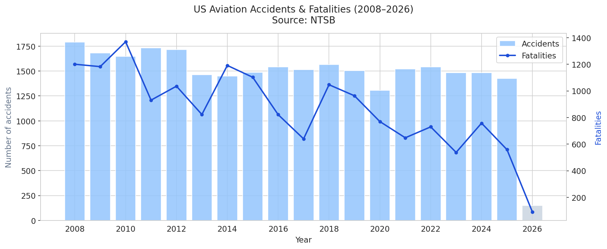
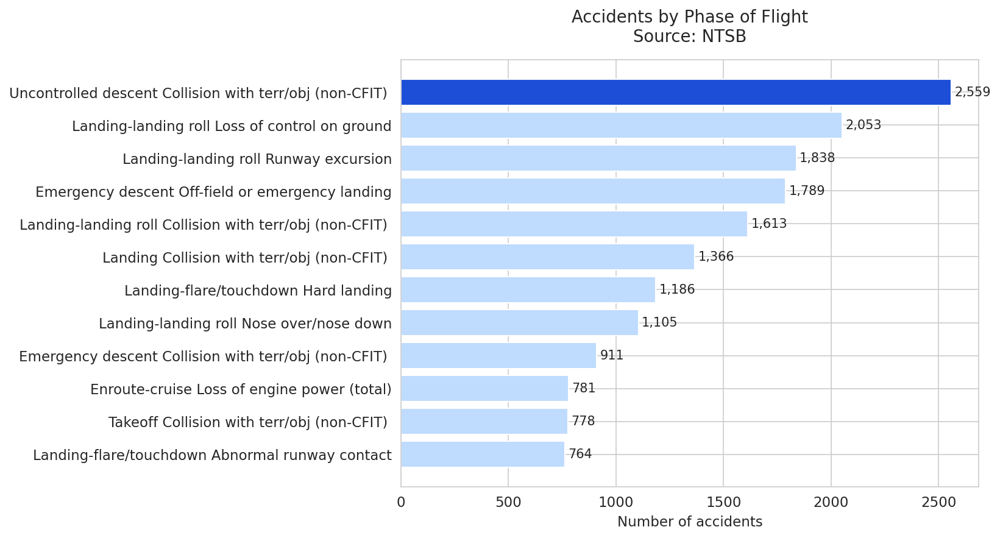
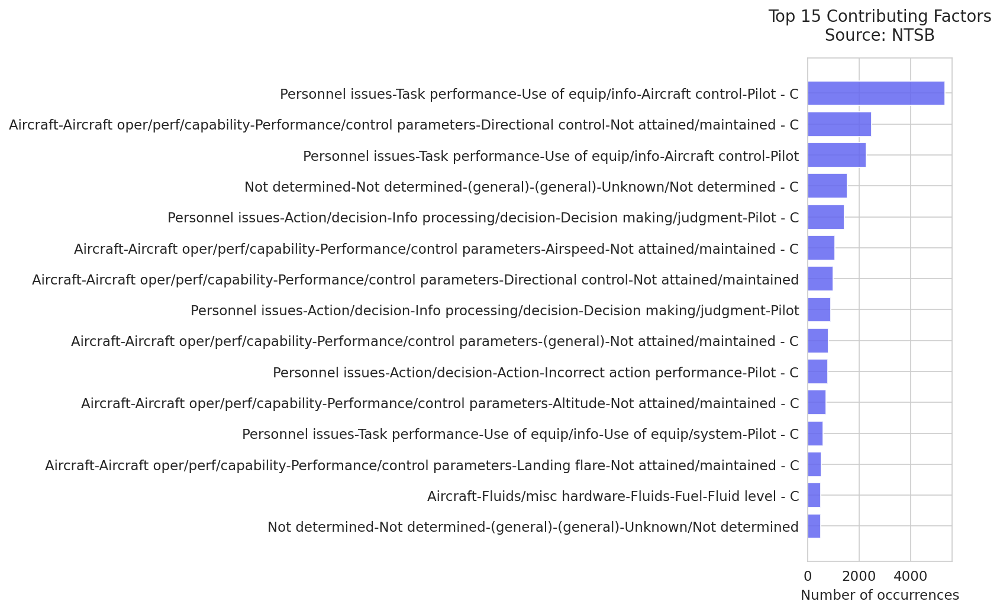
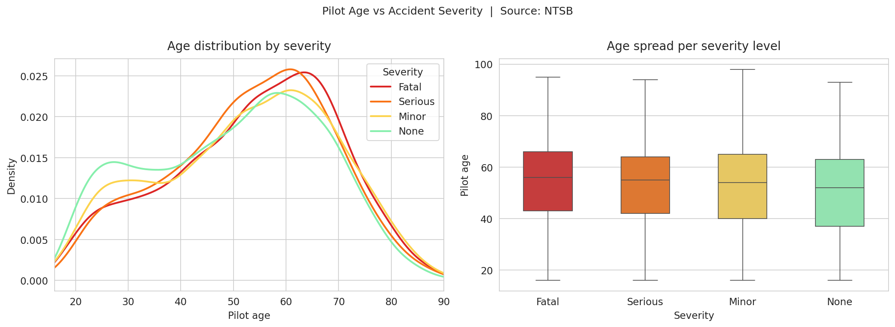
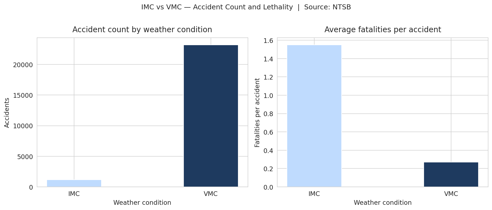

# US Aviation Accident Analysis (2008–2025)

Exploratory data analysis of **18,498 aviation accidents** recorded by the
National Transportation Safety Board (NTSB) between 2008 and 2025.

Built as a portfolio project, with a focus on flight phases, weather conditions, and human factors.

---

## Key findings

### 1. Accident counts have declined — fatalities are volatile



Total accidents fell from **1,790 in 2008 to 1,482 in 2023** — a 17% reduction
over 15 years. Fatalities, however, show no clean trend: they dropped from 1,201
in 2008 to a low of 538 in 2023, but spiked in years like 2010 (1,370) and 2014
(1,192), likely driven by a small number of high-fatality events.

> **Caveat:** this analysis counts accidents, not accident rates. A true safety
> rate would require flight-hour exposure data as a denominator.
> 2026 data is partial and excluded from trend interpretation.

---

### 2. Landing is where most accidents happen — uncontrolled descent is where people die



Landing-related phases account for the highest accident volume. However, the
deadliest category by average fatalities per event is **uncontrolled descent /
collision with terrain (non-CFIT)** — 2,559 accidents with an average of
**1.07 fatalities per event**, nearly 10× higher than most landing phases.

This reflects a known aeronautical reality: loss of control at altitude leaves
no recovery margin.

---

### 3. Human factors dominate contributing causes



The top contributing factor — appearing in **5,338 accidents** — is pilot
aircraft control performance. Decision-making and judgment failures rank in
the top 5. Mechanical causes are present but secondary.

NTSB investigators assign these codes, so frequency also reflects investigative
convention, not purely objective measurement.

---

### 4. Pilot age shows minimal relationship with accident severity



Median pilot age across severity levels is remarkably stable: **56 years
(fatal), 55 (serious), 54 (minor), 52 (none)**. The distributions largely
overlap, suggesting age alone is a weak predictor of whether an accident
turns fatal.

> **Note:** age is a crude proxy for experience. Total flight hours would
> be a sharper measure and is a natural extension of this analysis.

---

### 5. IMC accidents are 5.7× more lethal per event than VMC



| Condition | Accidents | Fatalities | Fatality rate |
|-----------|----------:|----------:|--------------|
| VMC       | 23,199    | 6,293     | 0.271         |
| IMC       | 1,173     | 1,822     | 1.553        |

VMC accidents are **20× more frequent** — most general aviation flying happens
in visual conditions. But IMC accidents produce **1.55 fatalities per accident
on average**, compared to 0.27 for VMC.

A fatality rate above 100% means many IMC accidents kill more than one person.
This aligns with known aeronautical risk factors: a VFR pilot entering IMC
has an average of 178 seconds before losing control due to spatial
disorientation. CFIT accidents are disproportionately concentrated in IMC.

---

## Data source

**NTSB Aviation Accident Database**
[ntsb.gov/safety/data/Pages/Data_Stats.aspx](https://www.ntsb.gov/safety/data/Pages/Data_Stats.aspx)

Download `avall.zip`, extract `avall.mdb`, place in `data/`. See `data/README.md`
for full instructions.

- **Period:** 2008–2025 (2026 partial, excluded from analysis)
- **Records:** 18,498 accidents (`ev_type = 'ACC'`)
- **Format:** Microsoft Access `.mdb` → converted to SQLite

---

## Project structure
```
aviation-EDA/
├── README.md
├── requirements.txt
├── charts/                  # all output charts
├── data/
│   ├── README.md            # how to download the raw data
└── notebooks/
    ├── 01_data_loading.ipynb   # MDB → SQLite conversion (run once)
    └── 02_eda.ipynb            # full analysis
```

## How to run
```bash
git clone https://github.com/miguelRepo/aircraft-accidents-analysis.git
cd aviation-EDA
pip install -r requirements.txt
# Download avall.mdb — see data/README.md
jupyter notebook notebooks/01_data_loading.ipynb  # run once
jupyter notebook notebooks/02_eda.ipynb
```

---

## Limitations

1. **No exposure denominator** — accident counts, not rates. More flights = more accidents.
2. **Accidents only** — near-misses and unreported incidents are absent.
3. **IMC/VMC gaps** — weather condition missing for a share of records.
4. **Age ≠ experience** — flight hours from `flight_time` table would be sharper.
5. **Findings reflect investigator judgment** — not purely objective measurement.

---

## Author

Miguel — Aeronautical Engineer focused on systems, reliability, and data.
[LinkedIn](https://www.linkedin.com/in/miguel-restrepo-data-science/) · [GitHub](https://github.com/miguelRepo)
